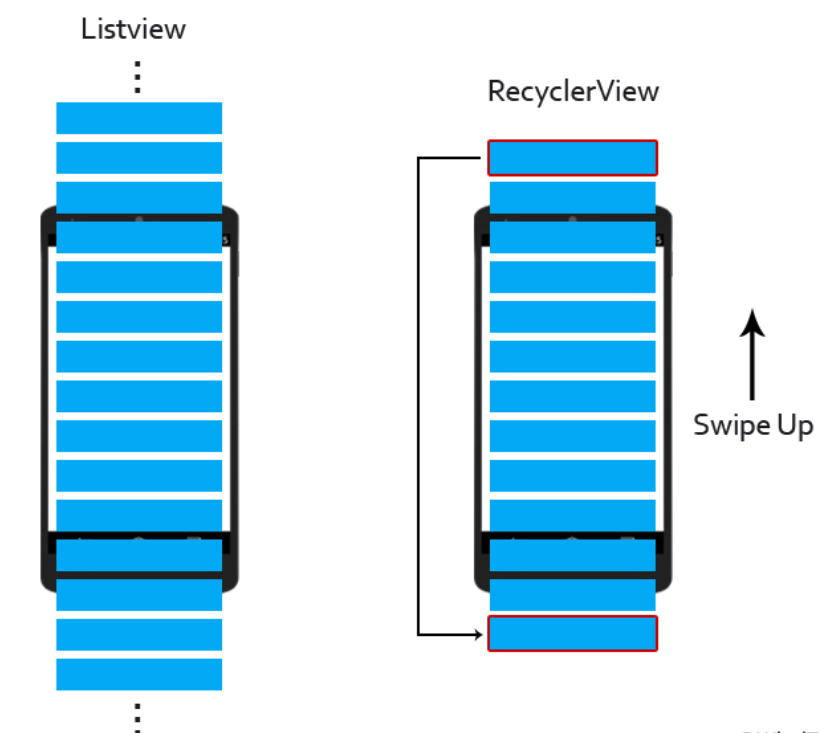

# News-App

### Overview
News App is a basic app which demonstrates android concept of Networking and fetching data over the internet. App uses **News API** to fetch top news headlines about latest events happening in the country which is displayed elegantly in the app.

### Libraries Used
  * Volley - an HTTP library that makes networking for Android apps easier and faster.
  * Glide - a fast and efficient image loading library for Android focused on smooth scrolling.
  * Facebook Shimmer 
  
### Android Features Covered
  * RecycleView
  * JSON Parsing
  * User-Permissions
  * DAO
  * Card View
  * Intent
  * List Adapter
  * Layouts
  * CustomTabs Intent

### Why Recycle View and not List View

